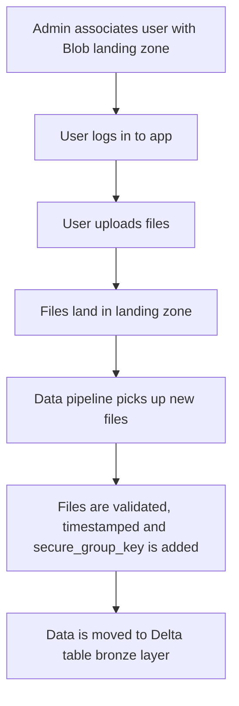

```mermaid
flowchart TD
    A[Admin associates user with Blob landing zone] --> B[User logs in to app]
    B --> C[User uploads files]
    C --> D[Files land in landing zone]
    D --> E[Data pipeline picks up new files]
    E --> F[Files are validated, timestamped and secure_group_key is added]
    F --> G[Data is moved to Delta table bronze layer]
```